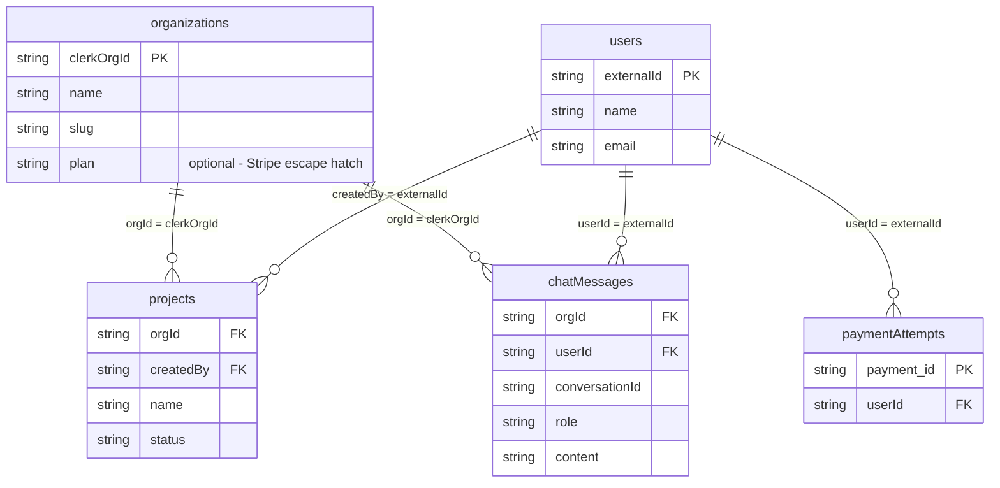

# CLAUDE.md

This file provides guidance to Claude Code when working with code in this repository.

## Project Overview

Scott's B2B SaaS Starter Kit — forked from `RayFernando1337/elite-next-clerk-convex-starter`, extended with multi-tenancy, org-scoped CRUD, AI chat, and background jobs.

**Goal:** A solo developer can fork this and have a working B2B SaaS prototype in minutes.

## Development Commands

- `npm run dev` — Start Next.js dev server with Turbopack on http://localhost:3000
- `npx convex dev` — Start Convex dev server (run in a separate terminal, required for DB)
- `npm run build` — Production build
- `npm run lint` — Next.js linting

## Architecture Overview

### Tech Stack
- **Next.js 15** App Router + React 19 + TypeScript
- **Convex** — realtime serverless database, webhook handlers, scheduled functions
- **Clerk** — auth, Clerk Organizations (multi-tenancy), Clerk Billing (per-org subscriptions)
- **Vercel AI SDK** (`ai`, `@ai-sdk/anthropic`, `@ai-sdk/openai`) — multi-model streaming chat
- **Tailwind v4** + **shadcn/ui** (new-york) + Framer Motion + Recharts
- **React Hook Form** + **Zod** — form validation
- **convex-helpers** — `authedQuery`/`authedMutation` wrappers for org-scoped data isolation

### Route Structure
```
app/
├── (marketing)/          # Public pages (landing, pricing, legal) — no auth
├── (auth)/               # Sign-in, sign-up, org-selection — Phase 2
├── (app)/                # Protected app shell (org required)
│   ├── layout.tsx        # Org guard + sidebar layout
│   ├── dashboard/        # → /dashboard (KPI cards, chart, table)
│   ├── projects/         # → /projects (org-scoped CRUD example)
│   ├── ai/               # → /ai (streaming chat, plan-gated)
│   ├── settings/         # → /settings, /settings/members, /settings/billing
│   └── admin/            # → /admin (org:admin role only)
├── api/
│   └── ai/chat/          # Vercel AI SDK streaming endpoint
└── layout.tsx            # Root layout (ThemeProvider → ClerkProvider → ConvexClientProvider)
```

### Multi-Tenancy Pattern
- Every org-scoped table has an `orgId: v.string()` field (Clerk org ID string, not Convex ID)
- **Never** write raw `ctx.db.query()` for org-scoped data — always use `authedQuery`/`authedMutation` from `convex/lib/auth.ts`
- Compound indexes always lead with `orgId`

```typescript
// convex/projects.ts
export const list = authedQuery({
  args: {},
  handler: async (ctx) => {
    return ctx.db.query("projects")
      .withIndex("by_orgId", (q) => q.eq("orgId", ctx.orgId))
      .collect();
  },
});
```

### Feature Gating
- Plan gating: `has({ plan: 'pro' })` via Clerk `<Protect>` or `auth.has()`
- Feature gating: `has({ feature: 'ai-chat' })` for specific capabilities
- Role gating: `has({ role: 'org:admin' })` for admin-only pages

### Route Protection
Middleware (`middleware.ts`) protects: `/dashboard(.*)`, `/projects(.*)`, `/ai(.*)`, `/settings(.*)`, `/admin(.*)`

## Key Integration Points

### Environment Variables
See `.env.example` for the full list. Key ones:
- `CONVEX_DEPLOYMENT` + `NEXT_PUBLIC_CONVEX_URL` — Convex
- `NEXT_PUBLIC_CLERK_PUBLISHABLE_KEY` + `CLERK_SECRET_KEY` — Clerk
- `NEXT_PUBLIC_CLERK_FRONTEND_API_URL` — from Clerk JWT template named "convex"
- `CLERK_WEBHOOK_SECRET` — set in **Convex dashboard** env vars, NOT .env.local
- `ANTHROPIC_API_KEY` + `OPENAI_API_KEY` — AI providers

### Clerk Dashboard Configuration (required)
1. Enable **Organizations** in Clerk Dashboard
2. Update JWT template "convex" to include `org_id` and `org_role` claims
3. Enable Clerk Billing → create "Plans for Organizations" (Free, Pro, Enterprise)
4. Redirect URLs: `/sign-in` force redirects to `/org-selection`

### Webhook Configuration
Clerk webhooks point to Convex HTTP endpoint (see `convex/http.ts`):
- Events: `user.created`, `user.updated`, `user.deleted`
- Events to add: `organization.created`, `organization.updated`
- Events: `paymentAttempt.updated`

### Convex Schema

All FK values are **Clerk string IDs**, not Convex document IDs. `orgId` on every org-scoped table equals `organizations.clerkOrgId`.



## Shadcn Component Installation
When installing shadcn/ui components use: `npx shadcn@latest add [component-name]`
